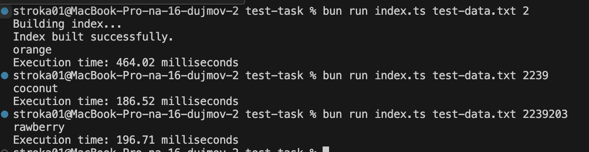

# Random line from a file

## Task:

- Problem: Random line from a file
- You are given a very, very large plain text file where each line contains a plain
  text string. The file has at most 1 billion lines; lines may have different lengths,
  but each line has at most 1000 characters.
- Your goal is to write a program that
  will print an arbitrary line from the file. Your program will be run many times
  (although you don't know exactly how many times it will be run in advance), and
  you don't know in advance which lines might be selected.
- Thus, your solution should be optimized to minimize the runtime for each additional execution. The first execution of the program may take longer than subsequent runs, and you
  may use additional disk storage to improve performance.
  Your program should take two command-line arguments: the path of the input
  file from which to print lines, and the index of the line you want to print.
- Your program should write the line to standard output.

- I used bun.js because this runtime has built-in TypeScript compilation
- Of course, in production code, I will use Node.js.
- I tried to use different languages, but for this job, I guess it will be better to use JavaScript/TypeScript

To install dependencies:

```bash
bun install
```

To run:

```bash
bun run index.ts  <filePath> <lineNumber>
```

example

```bash
bun run index.ts test-data.txt 2
```

Tests:



- The first execution always takes more than two times as long
- For testing purposes, I used a TXT file with approximately 3 million lines of data

This project was created using `bun init` in bun v1.1.21.
